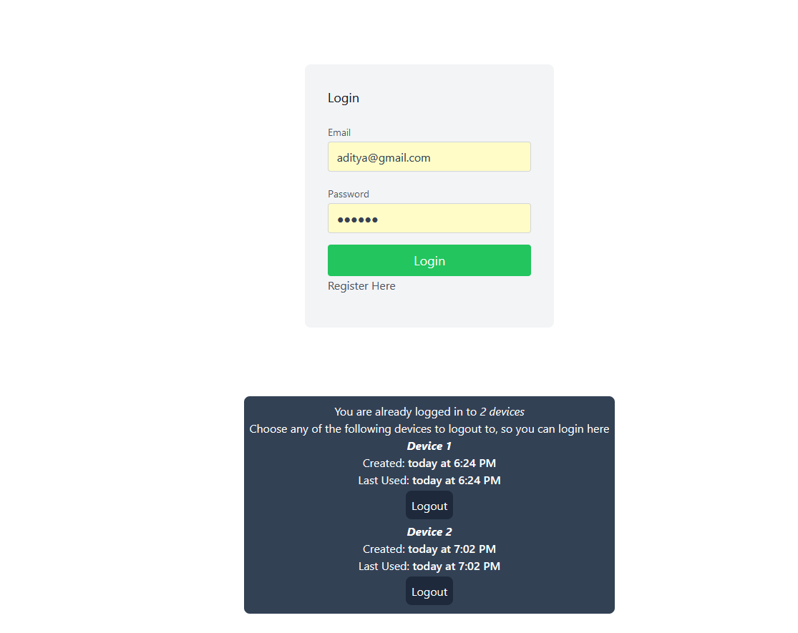

## Installation

Before starting the application, create a file `.env` with the following text.
There are other values as well needed, but they have provided with defaults.

```
DATABASE_URL="file:./dev.db"
```

### Start the application

```bash
npm i #Install Dependencies
npm run prisma-migrate -- --name init # Migrate the database
npm run dev # Start the application
```

### Frontend

- The user will get an option to revoke devices so they can login to new devices.
- To test this out, simply Register -> Log Out -> Log In -> Log Out -> Log In.


